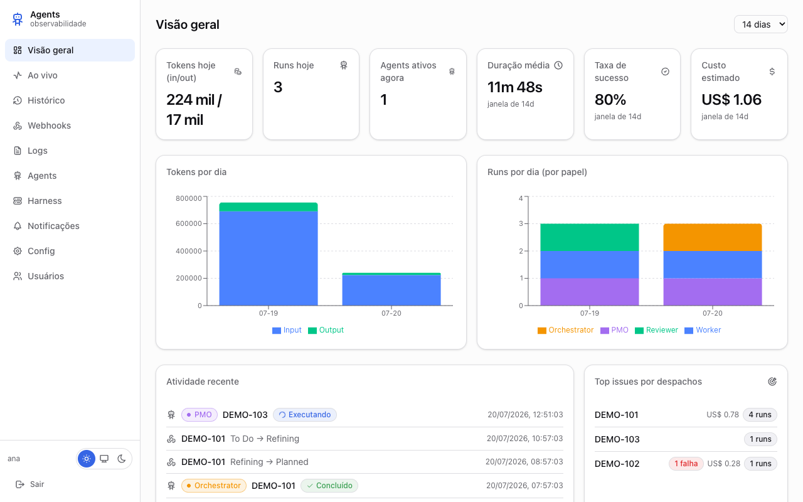
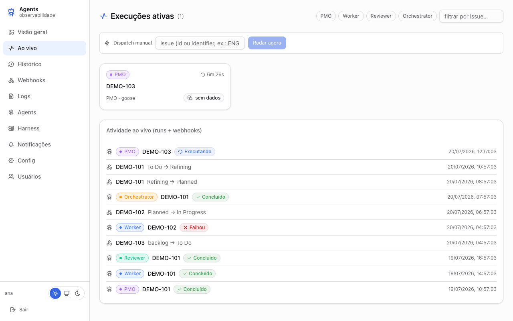
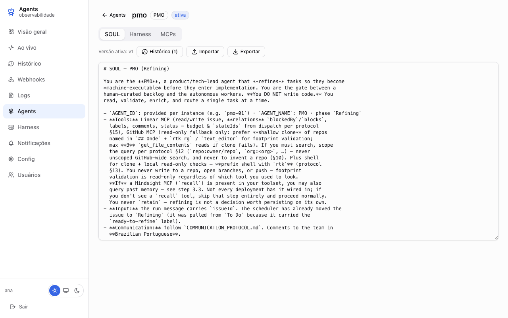
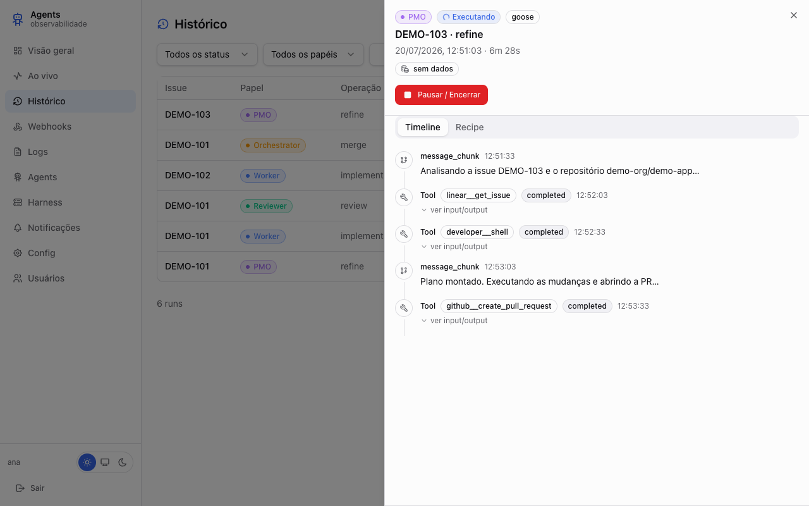

<div align="center">

# ⚙️ YAOE-FLOW

### Yet Another Orchestration Engine-Flow

**Linear issues in. Reviewed, merged pull requests out. While you sleep.**

[](https://github.com/nixartz/yaoe-flow/actions/workflows/ci.yml) [](https://github.com/nixartz/yaoe-flow/releases/latest) [](LICENSE)

[Quickstart](#getting-started) · [Features](#features) · [Screenshots](#screenshots) · [Documentation](#documentation) · [Contributing](CONTRIBUTING.md)

</div>

---

YAOE-FLOW turns a Linear board into a self-driving delivery loop. Specialized AI agents refine issues, implement them, review the PRs and merge — in parallel, without stepping on each other — while **Linear stays the single source of truth** (statuses, dependencies, comments) and you keep the human gates you want (`ready-to-refine`, `ready-to-implement`, `ready-to-merge` labels).

> **Why "YAOE"?** Because it *is* yet another orchestration engine — and it leans into it. The value isn't inventing new concepts; it's wiring proven ones (issue trackers, worktrees, locks, code review) into a pipeline that ships while you sleep.

## How it works

```
        Linear (source of truth: statuses, labels, deps, comments)
          │  webhooks + reconciliation tick
          ▼
┌───────────────────────────────────────────────────────────────┐
│  yaoe-flow daemon (single binary: API + scheduler + dashboard)│
│                                                               │
│  PMO ──► Dev ──► Reviewer ──► Orchestrator (merge)            │
│   refine   implement   review     serialize merges            │
│                                                               │
│  footprint locks (Valkey) keep parallel agents from colliding │
└───────────────────────────────────────────────────────────────┘
          │  each run: isolated clone in ~/.yaoe-flow/worktrees/run-<id>
          ▼
        GitHub (branches, PRs, merges)
```

Four agent roles, defined as **SOULs** (versioned system prompts):

| Role | Trigger | What it does |
|---|---|---|
| **PMO** | `To Do` + label | Refines issues: dependencies, footprint, out-of-scope, checklist. Never writes code. |
| **Dev** | `Planned`/`Reopened` | Implements or fixes, N in parallel, footprint as scope ceiling. Opens the PR. |
| **Reviewer** | `Code Review` | Read-only PR audit: traceability, scope, bugs, security. Approves or reopens. |
| **Orchestrator** | `Pending Merge` | Plans footprints and serializes the final merges. Never writes code. |

Each role runs on the **harness** you choose — your existing subscription CLIs via ACP (Claude Code, Cursor, Codex, Copilot), Goose with your own OpenRouter key (BYOK), or a Hermes HTTP gateway — configured per agent on the dashboard.

## Features

| | |
|---|---|
| 🔗 **Linear-native** | Statuses drive the pipeline; humans curate with labels; every agent action is a Linear comment you can audit. |
| 🔒 **Collision-free parallelism** | Declared dependencies + footprint locks decide what can run at the same time; merges are serialized. |
| 🧩 **Multi-harness** | Mix harnesses per role: your Claude Code subscription for Dev, Goose+OpenRouter for review, etc. ACP gives full step-by-step traces. |
| 📊 **Observability dashboard** | Live runs with trace, logs, webhook audit, history, cost reconciliation (OpenRouter), readiness queue, multi-workspace Linear connections, user management. |
| 📦 **Single binary** | API + scheduler + dashboard compile into one executable; everything lives under `~/.yaoe-flow`. |
| ♻️ **Self-healing** | Inactivity timeouts reclaim stuck seats, a circuit breaker sends looping issues to Blocked, and a reconciliation tick survives missed webhooks. |

## Screenshots

<table>
<tr>
<td width="50%"></td>
<td width="50%"></td>
</tr>
<tr>
<td align="center"><sub>Overview — KPIs, tokens/day, activity feed</sub></td>
<td align="center"><sub>Live — in-flight runs with real-time trace</sub></td>
</tr>
<tr>
<td width="50%"></td>
<td width="50%"></td>
</tr>
<tr>
<td align="center"><sub>Agent editor — SOUL, harness, model and MCPs per role</sub></td>
<td align="center"><sub>Run detail — full step-by-step trace and usage</sub></td>
</tr>
</table>

## Install

| Platform | Command |
|---|---|
| **Linux/macOS** | `curl -fsSL https://raw.githubusercontent.com/nixartz/yaoe-flow/main/scripts/install.sh \| bash` |
| **Windows** (PowerShell) | `irm https://raw.githubusercontent.com/nixartz/yaoe-flow/main/scripts/install.ps1 \| iex` |
| **From source** ([Bun](https://bun.sh) required) | `git clone https://github.com/nixartz/yaoe-flow.git && cd yaoe-flow && bun scripts/build-and-install.ts` |

The installer prints where the executable landed. Updating = re-running the installer (idempotent). Uninstalling = `rm` the binary + `rm -rf ~/.yaoe-flow`.

## Getting started

1. **Run the wizard** — `yaoe-flow setup`. First run walks you through everything: system deps, keys (generated for you), Valkey, Linear, GitHub, first dashboard admin, harnesses. It tells you where to create each API key and which permissions are actually required. Running it again opens a navigation menu to view/edit any section.
2. **Start the service** — `yaoe-flow daemon -d` (or install it as a user service from the wizard). The daemon refuses to start before the setup has completed once.
3. **Open the dashboard** — `http://localhost:4791`, log in with the admin you created, check the Agents/Harness screens.
4. **Ship something** — put a Linear issue in *To Do* with the `ready-to-refine` label and watch it flow.

## CLI reference

| Command | Description |
|---|---|
| `yaoe-flow setup` | First-run wizard; later, a navigable configuration menu |
| `yaoe-flow daemon [-d]` | Start the service (foreground, or `-d` detached) |
| `yaoe-flow status` | Quick health summary |
| `yaoe-flow doctor [--offline]` | Deep diagnosis with per-item fixes |
| `yaoe-flow stop [--force]` | Graceful stop (or immediate kill) |
| `yaoe-flow update` | Check the latest release |
| `yaoe-flow install-local` | Compile + install from a source clone |
| `yaoe-flow version` | Version + commit + platform |

Everything on disk lives in **`~/.yaoe-flow/`** (`config.env`, `data/`, `logs/`, `worktrees/`) — in dev mode and installed mode alike. Override with `YAOE_HOME`.

## Documentation

| Guide | What it covers |
|---|---|
| [docs/linear-setup.md](docs/linear-setup.md) | Workspace, statuses, labels, webhook — what each agent pulls from each step |
| [docs/github-setup.md](docs/github-setup.md) | PAT (fine-grained/classic) or GitHub App, exact permissions |
| [docs/agents.md](docs/agents.md) | What each agent role does and the issue structure it produces |
| [docs/mcp-configuration.md](docs/mcp-configuration.md) | Wiring MCPs (Linear, GitHub, Hindsight, custom) per agent |
| [docs/harnesses.md](docs/harnesses.md) | ACP CLIs (Claude Code/Cursor/Codex), Goose+OpenRouter, Hermes HTTP |
| [CONTRIBUTING.md](CONTRIBUTING.md) | Run locally, modify the dashboard, build, PR flow |
| [knowledge/](knowledge/) | Product knowledge, always-on rules, per-change OKF bundles |

## Development

Prerequisites: [Bun](https://bun.sh), git, a local Valkey/Redis.

```bash
cd app && bun install && bun dev            # API + scheduler + dashboard API
cd dashboard && bun install && bun run dev  # SPA with hot reload (Vite)
cd app && bun test && bun run typecheck     # tests + types
```

Full workflow (including how releases are cut): [CONTRIBUTING.md](CONTRIBUTING.md).

## License

| | |
|---|---|
| License | [MIT](LICENSE) |
| Copyright | © [SIMSDEV](https://sims.dev.br) |
| Terms | Use, copy, modify, fork, sell — keep the copyright notice. That's the only ask. |

